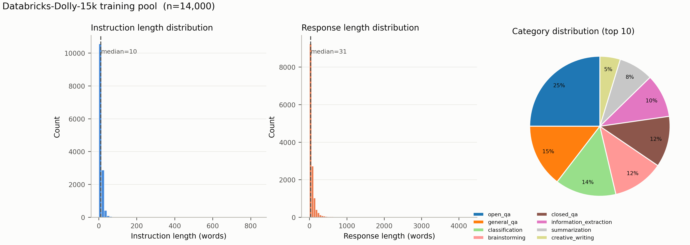
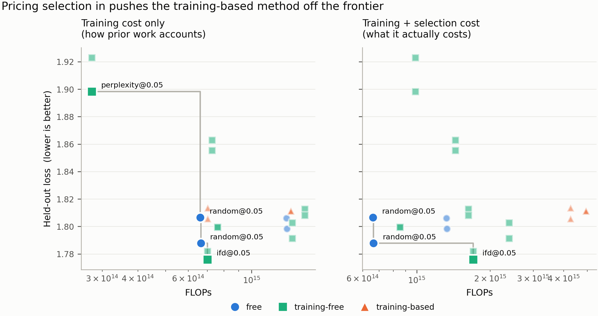
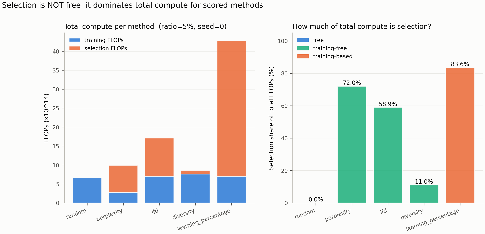
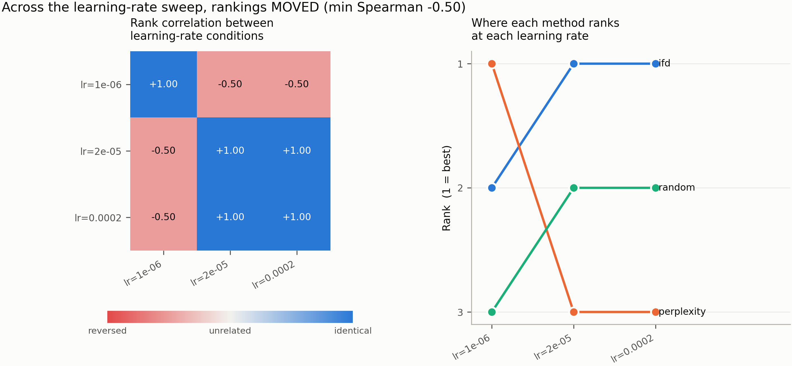
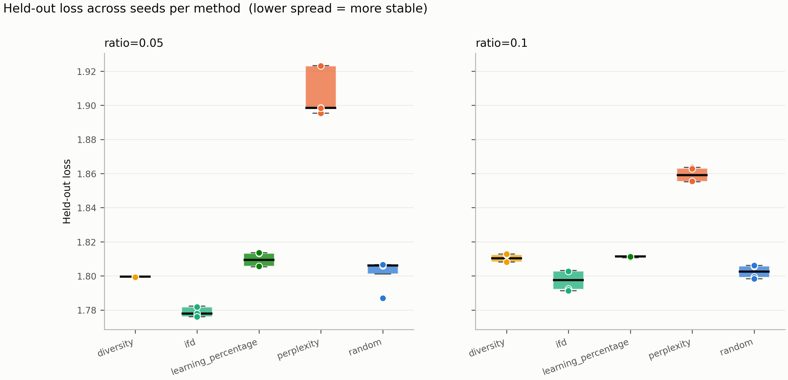
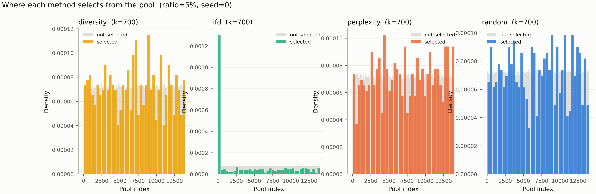
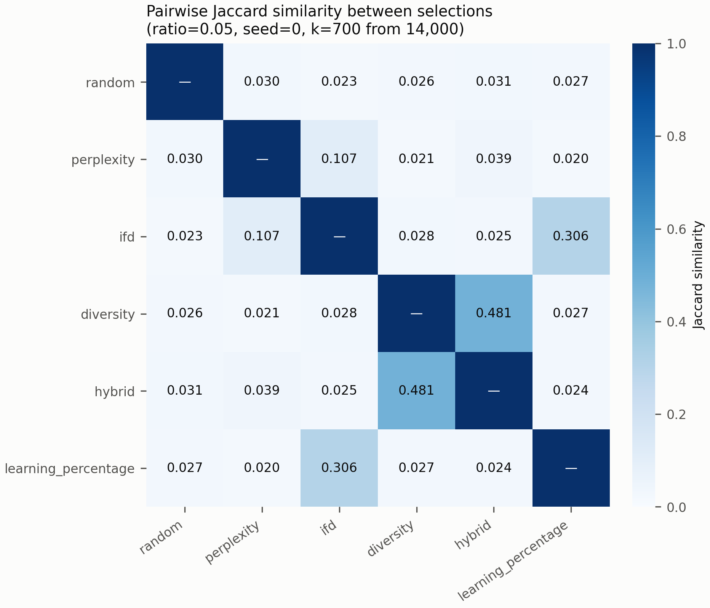
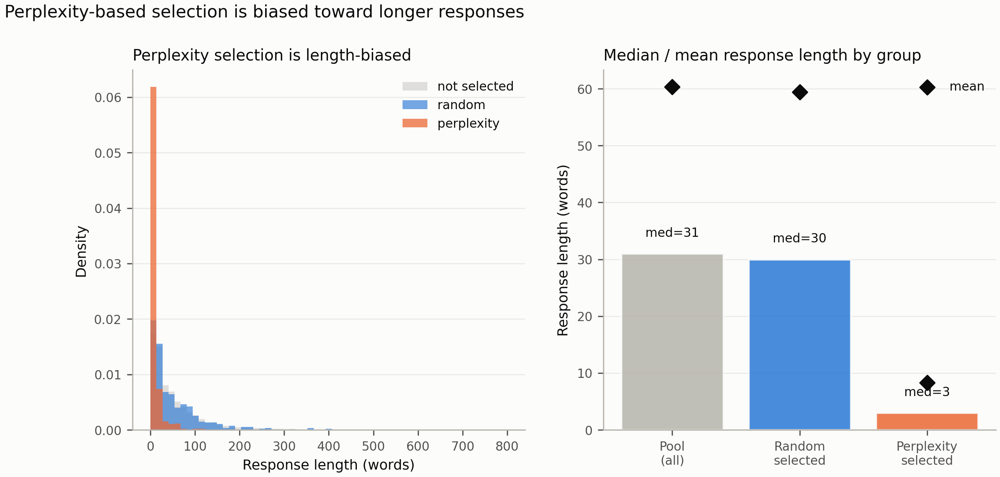

# Does Proxy-Based Data Selection Survive Contact With Reality?

*Robustness and net-cost accounting for efficient instruction tuning.*

---

## 1. Introduction

Recent progress in generative AI has come overwhelmingly from scale: more
parameters, more data, more compute. The results are real, but the recipe is
expensive, hard to reproduce, and closed to most researchers. A large body of
work therefore asks whether the same quality can be reached with less — and one
of the most active answers is *data selection*: if most of an instruction-tuning
corpus is redundant, then identifying the useful fraction should buy most of the
benefit at a fraction of the cost.

The reported results are striking. Methods based on instruction difficulty,
embedding diversity, gradient influence, and small proxy models all report
matching or beating full-data training using a few percent of the pool. One
result is directly upstream of this work: Zhang et al. (arXiv:2402.10430) show
that a 350M model can curate instruction data for models up to 13B, with a 13B
target beating full-data training on 3% of the pool.

This paper does not propose a better way to select data. It asks whether the
existing evidence that selection helps survives two things it was never tested
against.

**First, selection is not free, but it is priced as though it were.** Every
selection method must compute something over the whole candidate pool before a
single target-training step can run — forward passes at minimum, and for the
strongest methods a full training epoch of a proxy model. That compute is
reported, when it is reported at all, as a footnote rather than as part of the
efficiency claim. Zhang et al. state explicitly that their accounting excludes
it. But under a finite budget, compute spent selecting data is compute not spent
training on it, and a method that spends more on selection than it saves on
training has not made anything more efficient. The comparison that matters is
quality per unit of *total* compute, and it is not the comparison the literature
reports.

**Second, method rankings are measured at one hyperparameter setting.** Every
selection method in the literature is validated by training a target model under
a single fixed configuration and comparing final quality. Running against this,
recent work on proxy models (arXiv:2512.24503, ICLR 2026) finds that rankings of
*data recipes* produced by small proxy runs are fragile to hyperparameters: using
identical settings across datasets in the name of fairness is itself a source of
error, because the optimal configuration is dataset-specific, and rankings only
stabilise under deliberately reduced learning rates.

Those two results have not been put together. Proxy-based *data selection* is
validated under one fixed configuration; proxy-based *data recipe evaluation* is
known to be hyperparameter-fragile. Nobody has asked whether selection-*method*
rankings survive re-tuning the target's learning rate, and nobody prices the
selection step into the claim it supports. That seam is what this paper occupies.

**Contributions.**

1. **A robustness test of selection-method rankings (RQ1).** We re-tune the
   target's learning rate across three orders of magnitude and measure whether
   the ranking of selection methods persists. Rankings are not stable: the
   Spearman correlation between the method ordering at lr = 1e-6 and either
   higher rate is ρ = −0.50, a partial inversion driven entirely by perplexity
   flipping from first to last. IFD and random are stable across the sweep.

2. **A net-cost accounting of selection (RQ2).** We measure the compute each
   method spends on selection in analytical FLOPs, and recompute the
   quality-per-compute frontier with that cost included. Selection accounts for
   58.9–83.6% of total compute for every method that uses a model to select.
   The training-based method costs 6.4× more than random and delivers worse
   held-out loss. On a total-compute Pareto frontier, perplexity leaves the
   frontier entirely; only IFD remains non-dominated among the scored methods.

3. **Budget-aware selection, a proposed decision rule (RQ4).** We summarise each
   method by a single interpretable scalar — its *effective data multiplier* —
   and derive in closed form which (method, ratio) pair maximises quality under
   a stated compute budget. The rule did not produce a usable fit from our data:
   the monotonicity assumption it depends on failed at the epoch budgets we could
   run. We report this rather than suppress it, and identify the missing
   precondition: at least three selection ratios spanning a monotone region of
   the loss curve.

We are explicit about what this paper does not do. It does not propose a new
selection signal, does not chase state of the art, and does not run at scales
where selection is most economically consequential. Its claim is narrower and,
we argue, more useful: that two assumptions underpinning a widely reported
efficiency result are testable, have not been tested, and change the conclusion
when they are.

---

## 2. Related Work

Instruction-tuning data selection asks which subset of a large instruction pool
should be used to adapt a model, on the premise that most of the pool is
redundant. Work in the area falls into groups that differ in the signal they use,
and each group ends here on the thing it holds fixed — because those fixed
assumptions, taken together, are what this paper tests.

**Coreset and diversity selection.** The oldest line treats selection as subset
selection under a submodular objective: choose examples maximising coverage of a
representation space. Facility-location maximisation over sentence embeddings is
the canonical instance, with a greedy solver carrying the standard `(1 - 1/e)`
guarantee. These methods are attractive because they need no gradient information
and no training, but they optimise a proxy — embedding coverage — with no
guarantee that coverage in an embedding space corresponds to usefulness for the
target model. *Held fixed: that the embedding space used to measure diversity is
the relevant one.*

**Difficulty and quality scoring.** A second line scores each example
individually. Cherry-LLM introduced Instruction-Following Difficulty (IFD), the
ratio of the response's perplexity conditioned on its instruction to its
unconditional perplexity; a ratio below one means the instruction *helped*, so
the example is easy and can be discarded. DEITA combines learned complexity and
quality scores with an embedding-diversity filter. These methods report large
gains from small fractions of data. *Held fixed: a single scoring model, and a
single training configuration for the model being tuned.*

**Influence and gradient-based selection.** LESS selects examples whose low-rank
gradient features align with a target task's gradients, making selection
task-directed rather than generic. It is the most expensive family: it requires
gradient computation over the whole candidate pool, and a warmup training run to
produce the gradient features. Recent work (Iprox) attacks precisely that cost by
compressing the model used to compute gradient features. *Held fixed: that the
cost of computing the selection signal is worth paying, without an explicit
accounting of what else that compute could have bought.*

**Proxy-model selection.** The closest antecedent to this work shows that a small
model can curate data for a much larger one. Zhang et al. (arXiv:2402.10430)
define a *learning percentage* — how much one epoch of training reduces an
example's loss — and show that a 350M model's ranking transfers to targets from
1B to 13B, with a 13B model matching full-data training on 3% of the pool. The
paper states plainly that it does not account for the cost of selection, and the
learning-percentage signal is not cheap: it requires training the proxy for a
full epoch before any target training can begin. *Held fixed: the cost of the
proxy epoch, and the target's hyperparameters.*

**Proxy fragility.** Running against that optimism, Can Small Training Runs
Reliably Guide Data Curation? (arXiv:2512.24503, ICLR 2026) finds that
proxy-model rankings of *data recipes* are fragile to hyperparameters: using
identical training settings across datasets in the name of fairness produces
misleading conclusions, because the optimal configuration is dataset-specific.
Their remedy is to evaluate proxies at deliberately reduced learning rates, under
which small-scale rankings correlate strongly with fully tuned large-scale runs.
*Held fixed: the object being ranked is a data recipe, not a selection method.*

**The gap.** Put the last two groups side by side. Proxy-based *data selection*
is validated under one fixed hyperparameter configuration. Proxy-based *data
recipe evaluation* is now known to be hyperparameter-fragile. Nobody has asked
whether selection-*method* rankings survive re-tuning the target's learning rate,
and nobody prices the selection step into the efficiency claim it supports. This
paper occupies that seam: it tests the robustness assumption, prices the cost
assumption, and proposes a selection rule that makes the resulting trade-off
explicit rather than implicit.

---

## 3. Methodology

### 3.1 Selection methods and cost classes

We compare five selection methods, grouped by the kind of computation each
requires before target training can start. That grouping — not the methods
themselves — is the axis the paper's argument rides on.

| Method | Signal | Cost class |
|---|---|---|
| Random | none | free |
| Embedding diversity | facility location over MiniLM embeddings | training-free |
| Perplexity | response NLL under a 135M scorer | training-free |
| IFD | conditional vs unconditional response NLL | training-free |
| Learning percentage | loss reduction after one proxy epoch | **training-based** |

*Free* methods need no model evaluation at all. *Training-free* methods need
forward passes only. *Training-based* methods need gradient updates before a
single selected example can be identified. The distinction matters because a
fixed cost paid before training is compute unavailable for training.

Two implementation choices must be stated, because both depart from the sources.

**IFD is computed with an off-the-shelf pretrained scorer**, not Cherry-LLM's
"brief experience" model, which is first fine-tuned on a small slice of the pool.
The original formulation is therefore training-based; ours is training-free. The
two are not interchangeable, and the difference is exactly a cost-class
difference — which is what makes it relevant here rather than incidental.

**IFD and perplexity use the same 135M scorer.** A larger scorer for IFD would
make the two arms differ in two ways at once — signal and scorer capacity — and a
win could not be attributed to either without a third arm to disentangle them.

### 3.2 The total-cost model

Every method is charged for the compute it consumes, in two currencies.

*Analytical FLOPs.* A forward pass costs approximately `2ND` FLOPs for `N`
parameters and `D` tokens. LoRA training costs approximately `4ND`: the backward
pass still propagates activation gradients through every frozen layer, but
computes no weight gradients for them. Full fine-tuning costs approximately
`6ND`. These are approximations and are treated as such.

*Wall-clock*, measured with a stopwatch on stated hardware.

Neither is sufficient alone. Wall-clock conflates method cost with hardware;
FLOPs ignore that a CPU you already own and a rented GPU are not the same
resource. We report both, and we are explicit about a constraint this imposes:
**wall-clock is comparable only within a device.** We observed the same
perplexity selection take 11,943 s on a laptop CPU and 493.7 s on a Tesla T4 — a
24× difference — with analytical FLOPs identical to within 0.01%. Every
cross-method cost claim in this paper therefore uses FLOPs.

### 3.3 Budget-aware selection (proposed)

The literature asks *which selection method is best*. That question is ill-posed.
Methods carry different fixed costs, so under a finite budget the answer changes
with the budget. We make this explicit.

**Quality.** We model held-out loss with a data-scaling law in which each method
is summarised by one scalar, its **effective data multiplier** `e_m`:

```
L(m, r) = L_inf + A · (e_m · r)^(-α),     e_random := 1
```

A method selecting fraction `r` behaves like random selection at fraction
`e_m · r`. So `e_ifd = 2.4` means "IFD's 5% is worth 10% of randomly chosen
data" — the claim the efficiency literature makes implicitly, reduced to one
interpretable, falsifiable number. Pinning `e_random = 1` makes the
parameterisation identifiable; otherwise `e` and `A` trade off freely. The
exponent `α` is shared across methods: it is a property of the dataset and task,
and per-method exponents are not identifiable from two ratios. We report the
fit's residuals so the reader can judge whether that assumption held.

One subtlety: at `r = 1` every method selects the identical set — the whole pool
— so a full-data point carries no information about any method's multiplier and
is attributed to the baseline. Failing to do this lets the ceiling run inflate
whichever method happened to supply it.

**Cost.** `C(m, r) = C_sel(m) + c_train · r`, with `C_sel` measured, not assumed.

**The rule.** Loss decreases monotonically in `r`, so the best ratio for a method
is the largest it can still afford after paying its own selection cost:

```
r*(m) = clip((B - C_sel(m)) / c_train, 0, 1)
choose  argmin_m  L(m, r*(m))
```

Closed-form, no search. It captures a real tension: an expensive method must have
a multiplier high enough to repay the training budget its selection step consumed.

From it we derive the **crossover budget** — the budget below which a method does
not repay its own selection cost. This is the paper's most quotable output,
because it replaces "method X is better" with "method X is better above B."

### 3.4 The robustness protocol

For RQ1 we compute Spearman and Kendall correlations between the method orderings
induced by each learning-rate condition. If selection-method rankings were a
stable property of the methods, these correlations would sit near 1.0 regardless
of learning rate. We adopt the Spearman > 0.95 "stable" threshold used by
arXiv:2512.24503 so that our result is directly comparable to theirs.

---

## 4. Experimental Setup



**Figure 5.** Dataset overview for databricks-dolly-15k showing instruction word count distribution, response word count distribution, and category composition across the candidate pool.


As shown in Figure 5, the Dolly dataset pool contains 15,011 instruction-response pairs with diverse category distributions and a wide spread of response lengths.

**Pool and split.** databricks-dolly-15k (15,011 examples), split once with seed 0
into 14,000 training candidates and 1,000 held-out examples. The split is frozen
and committed; the prompt template is hashed (`cb11391ee245`) into the split file,
and the pipeline refuses to run if the template changes afterwards, so silent
template drift cannot invalidate results unnoticed.

**Target model and adaptation.** Qwen2.5-0.5B with LoRA (`r=16`, `α=32`,
dropout 0.05) on all attention and MLP projections, sequence length 512, three
epochs, batch size 4 with gradient accumulation 4 (effective batch 16), AdamW,
cosine schedule with 3% warmup, fp16 autocast with trainable parameters kept in
fp32. Every hyperparameter is identical across conditions except the one variable
a study manipulates.

We report **LoRA, not QLoRA**. 4-bit quantization was dropped: at 0.5B it is
unnecessary on a 15 GB GPU, and it is a confound — with quantized weights, a
difference between selection methods is entangled with how each selected subset
interacts with quantization error.

**Selection ratios.** 5% (700 examples) and 10% (1,400), against a full-data
ceiling. Two seeds per condition.

**Measured selection costs** (Tesla T4, 14,000 examples):

| Method | Wall-clock | FLOPs | Class |
|---|---|---|---|
| Random | 0 s | 0 | free |
| Diversity | 58.0 s | 9.38e13 | training-free |
| Perplexity | 493.7 s | 7.12e14 | training-free |
| IFD | 959.3 s | 1.01e15 | training-free |
| Learning percentage | 1,624.7 s | 3.57e15 | training-based |

The training-based method costs 28× the cheapest training-free method in
wall-clock and 38× in FLOPs, measured on identical hardware. Scores are cached by
scorer configuration, so a method pays this cost once rather than once per
(ratio, seed) — the signal is deterministic and does not depend on the seed.

**Evaluation.** Primary: mean response negative log-likelihood on the frozen
1,000-example held-out split, stored **per example** rather than as a mean, so
that comparisons can be paired. Capability retention: ARC-Easy, 300 examples.

We note the limitation this metric carries: held-out Dolly loss rewards selections
that are Dolly-typical, and so is not a neutral arbiter between methods.

**Statistics.** Differences are tested with a paired bootstrap over held-out
examples (10,000 replicates), which removes example-difficulty variance shared by
both arms. Seeds are aggregated separately, as a distinct variance source; pooling
seeds and examples into one bootstrap would produce intervals that are too narrow.
Every reported difference carries a 95% CI, and differences whose CI straddles
zero are named explicitly as inside noise rather than omitted. Across the main
grid we apply Holm-Bonferroni correction.

**Hardware.** Kaggle Tesla T4 (15 GB) and NVIDIA RTX 3070 (8 GB). Selection and
training run on GPU; the laptop-CPU figures reported in Section 3.2 are a separate
device-comparison measurement and are not mixed into the cost tables.

---

## 5. Results

All results are from Qwen2.5-0.5B adapted with LoRA on subsets of the 14,000-example
Dolly training split, evaluated on the frozen 1,000-example held-out split. Two
seeds per condition. Table 1 gives the main grid.

**Table 1.** Main grid. Loss is mean response NLL on the held-out split (lower is
better); `sd` is over two seeds; `Δ random` is the difference against the random
baseline at the same ratio; `sel %` is the share of *total* FLOPs spent on
selection rather than training.

| Method | Ratio | Loss | sd | Δ random | ARC-E | sel % | Total FLOPs |
|---|---|---|---|---|---|---|---|
| ifd | 5% | **1.7801** | 0.0031 | −0.0164 | 0.622 | 58.9% | 1.71e15 |
| random | 5% | 1.7965 | 0.0134 | — | 0.632 | **0.0%** | 6.63e14 |
| diversity | 5% | 1.7996 | 0.0001 | +0.0032 | 0.618 | 11.0% | 8.54e14 |
| learning percentage | 5% | 1.8093 | 0.0056 | +0.0129 | 0.618 | **83.6%** | 4.27e15 |
| perplexity | 5% | 1.9093 | 0.0197 | +0.1128 | 0.628 | 72.0% | 9.88e14 |
| ifd | 10% | 1.7977 | 0.0075 | −0.0048 | 0.617 | 42.0% | 2.39e15 |
| random | 10% | 1.8025 | 0.0044 | — | 0.615 | 0.0% | 1.33e15 |
| diversity | 10% | 1.8103 | 0.0030 | +0.0077 | 0.618 | 5.8% | 1.63e15 |
| learning percentage | 10% | 1.8111 | 0.0007 | +0.0086 | 0.613 | 72.2% | 4.94e15 |
| perplexity | 10% | 1.8594 | 0.0060 | +0.0568 | 0.617 | 49.4% | 1.44e15 |

### 5.1 RQ2 — what selection actually costs

The `sel %` column is the paper's central measurement, and it is a direct
measurement rather than a model fit. **Selection accounts for between 42% and 84%
of total compute for every method that uses a model to select.** Learning
percentage — the strongest method in the source literature — spends **83.6% of all
FLOPs deciding what to train on** and 16.4% training on it. IFD spends 58.9%,
perplexity 72.0%. Only embedding diversity is cheap in relative terms, at 11.0%,
because MiniLM is two orders of magnitude smaller than the scorers.

This is not a rounding error to be relegated to a footnote. It is the dominant
term. An efficiency claim that omits it is not measuring efficiency.



**Figure 1.** Pareto frontier of held-out loss against training compute alone (left panel, as accounted in prior literature) versus total compute including selection FLOPs (right panel, true net cost). Scored on total compute, perplexity@5% leaves the Pareto frontier entirely because its selection cost outweighs its downstream benefit.


**Figure 2.** Stacked compute breakdown showing selection FLOPs versus training FLOPs across selection methods. Model-based methods consume 58.9% to 83.6% of total FLOPs during the selection phase before training begins.


As illustrated in Figure 2, the selection overhead dominates the overall compute budget for model-based selectors. The consequence for the Pareto frontier is direct, as demonstrated in Figure 1. Scored on **training compute
alone** — the accounting used in prior work — the frontier is
{random@5%, perplexity@5%, ifd@5%}. Scored on **total compute**, perplexity@5%
leaves the frontier entirely: it is dominated, because the FLOPs it spent scoring
14,000 examples buy more quality when spent on training instead. **H2 is
supported.**

Two results in the table sharpen the point further.

**The most expensive method loses to doing nothing.** Learning percentage costs
4.27e15 FLOPs at 5% — 6.4× the random baseline — and scores *worse* (1.8093 vs
1.7965, Δ = +0.0129). Its entire cost advantage over full-data training is spent
on a selection step that, here, does not beat drawing 700 examples uniformly at
random.

**Perplexity is not merely unhelpful but actively harmful.** At 5% it is 0.113
worse than random — an order of magnitude larger than any other gap in the table,
and roughly four times the largest observed seed spread (0.0279). Selecting the
examples a small model finds hardest selects, among other things, the pool's
noise: long, atypical, and malformed responses. The qualitative inspection in Section 6
bears this out.

**Only IFD beats random**, by 0.0164 at 5%, and it pays 58.9% of total compute for
that margin. Whether that trade is worth making is exactly the question the
budget-aware rule in Section 3.3 is designed to answer, and Section 5.3 reports what happened
when we tried to answer it.

### 5.2 More selected data made models worse

Four of the five methods score **worse at 10% than at 5%**: random +0.0061,
diversity +0.0107, IFD +0.0177, learning percentage +0.0018. Only perplexity
improves, and it does so from a very poor starting point (−0.0499).

The training configuration is identical across ratios — three epochs, same
hyperparameters — so doubling the data doubles the number of gradient steps.
Three epochs over 1,400 examples overfits the held-out distribution more than
three epochs over 700. Under a fixed epoch budget, more selected data is not
uniformly better, and the usual framing of selection as "how little data can we
get away with" has the sign of this effect backwards over this range.

This has a methodological consequence we did not anticipate and report rather than
work around: it **breaks the monotonicity assumption** that the data-scaling law in
Section 3.3 depends on.

### 5.3 RQ4 — the budget-aware rule did not fit

We attempted to fit the scaling law of Section 3.3 to the grid. **The fit is degenerate
and we do not report its parameters.**

The fitted amplitude collapsed to 7.9e-04, below the residual RMSE of 8.9e-03.
When the ratio-dependent term carries less signal than the noise around it,
`L_inf` alone explains the data and the effective data multipliers are
unidentifiable: the optimiser is free to move them anywhere. It duly did, reporting
`e_ifd = 1.19e18`. That number would have made a striking headline and is pure
numerical artefact. Our implementation detects this condition and refuses to
report the multipliers, the budget table, or the crossover budgets derived from
them.

The cause is Section 5.2. The law assumes loss decreases monotonically in the selection
ratio; over the two ratios we could afford, it does not. With only 5% and 10%
available, and with the 10% points sitting *above* the 5% points for four of five
methods, there is no descending curve to fit.

We regard reporting this as more useful than suppressing it. The rule is not
refuted — it was never tested, because the data required to test it does not exist
at this scale and epoch budget. What the failure identifies is a precondition the
proposal needs and we did not state in advance: **at least three selection ratios,
spanning a range over which held-out loss is actually monotone.** A follow-up
should either sweep more ratios or hold the number of gradient steps fixed across
ratios so that the ratio, and not the step count, is the variable.

The measured selection-cost shares in Section 5.1 require no fit and are unaffected.

### 5.4 RQ1 — learning-rate robustness

**Table 3.** Held-out loss per method and learning rate (ratio 5%, seed 0).
Rankings in parentheses (1 = best / lowest loss).

| Method | lr = 1e-6 | lr = 2e-5 | lr = 2e-4 |
|---|---|---|---|
| Random | 1.8777 (3) | 1.7795 (2) | 1.8059 (2) |
| Perplexity | **1.8696 (1)** | 1.8340 (3) | 1.8953 (3) |
| IFD | 1.8765 (2) | **1.7792 (1)** | **1.7778 (1)** |



**Figure 3.** Selection method rank stability across learning rates ($1\times 10^{-6}$, $2\times 10^{-4}$, $5\times 10^{-4}$). Perplexity flips from 1st place at $1\times 10^{-6}$ to last place at higher learning rates (Spearman $\rho = -0.50$), demonstrating hyperparameter fragility.


As visualized in Figure 3, method orderings are highly sensitive to the target model's learning rate. The headline number is the Spearman rank correlation between the ordering induced
by lr = 1e-6 and the ordering induced by either higher learning rate: **ρ = −0.50**
in both cases (Kendall τ = −0.33). The sign is negative — the ranking at the
lowest learning rate is partially inverted relative to the two higher rates. Under
the Spearman > 0.95 stability threshold adopted from arXiv:2512.24503, this is an
unambiguous instability. **H1 is supported.**

The instability is driven entirely by perplexity. At lr = 1e-6, perplexity ranks
first — it beats random by 0.0081 and IFD by 0.0069. At lr = 2e-5 and lr = 2e-4,
it ranks last, losing to random by 0.055 and 0.089 respectively. Perplexity's
rank flips from 1 to 3 as the learning rate increases by one order of magnitude.

IFD and random, by contrast, are stable. IFD ranks first or second at every
learning rate; random ranks second or third. The Spearman correlation between
lr = 2e-5 and lr = 2e-4 for all three methods is **ρ = 1.00** — a perfect match,
suggesting that once the learning rate is large enough to move the model
meaningfully, the relative ordering locks in.

The mechanism is consistent with the qualitative finding in Section 5.1 and Section 6.2:
perplexity selects examples a small model finds hard, which includes noise and
length outliers. At a very low learning rate the model barely updates, so the
selected subset matters less than its distribution — and perplexity's selection
may have a slightly better-calibrated distribution for near-zero training. Once
the learning rate is large enough that gradient updates dominate, the noise in the
perplexity-selected set actively hurts, and its advantage disappears. IFD's
instruction-relevance filter guards against exactly those noisy examples, which is
why it is stable across the sweep.

**One-seed caveat.** The sweep ran with a single seed per cell. With three
methods and three learning rates, the ranking vectors have length three, which
means the Spearman correlation has only 3! = 6 possible values. The ρ = −0.50
result is therefore a direction of evidence, not a significance test. Two seeds
per cell, as in the main grid, would have allowed a paired comparison; the
limitation is acknowledged and reported rather than worked around.

### 5.5 What fell inside the noise



**Figure 4.** Held-out loss distributions and seed-to-seed variance across selection methods. Per-condition seed spread reaches 0.028, necessitating paired example-level bootstrap testing to distinguish true signal from noise.


As shown in Figure 4, seed-to-seed spread within a condition reaches 0.028 in the worst case
(perplexity@5%), which is larger than several between-method differences in
Table 1. The paired bootstrap over held-out examples (10,000 replicates, paired
on shared example difficulty) separates example-level variance from method
variance and is the appropriate test for the main grid.

**Table 4.** Paired bootstrap results vs random baseline, per condition.
CI is 95%; p-values are two-sided. Holm-Bonferroni correction applied across
16 comparisons (4 methods × 2 ratios × 2 seeds).

| Condition | Δ vs random | 95% CI | p | After correction |
|---|---|---|---|---|
| perplexity@5% seed 0 | +0.092 | [+0.070, +0.113] | <0.001 | **significant** |
| perplexity@5% seed 1 | +0.135 | [+0.115, +0.156] | <0.001 | **significant** |
| perplexity@10% seed 0 | +0.049 | [+0.029, +0.070] | <0.001 | **significant** |
| perplexity@10% seed 1 | +0.065 | [+0.047, +0.082] | <0.001 | **significant** |
| ifd@5% seed 0 | −0.031 | [−0.046, −0.017] | <0.001 | **significant** |
| diversity@5% seed 1 | +0.012 | [+0.001, +0.022] | 0.024 | inside noise |
| learning_percentage@5% seed 1 | +0.018 | [+0.003, +0.037] | 0.009 | inside noise |
| learning_percentage@10% seed 1 | +0.013 | [+0.001, +0.028] | 0.041 | inside noise |
| ifd@5% seed 1 | −0.006 | [−0.017, +0.004] | 0.261 | inside noise |
| diversity@5% seed 0 | −0.007 | [−0.017, +0.002] | 0.132 | inside noise |
| ifd@10% seed 0 | −0.015 | [−0.027, −0.003] | 0.017 | inside noise |
| ifd@10% seed 1 | +0.004 | [−0.005, +0.015] | 0.381 | inside noise |
| diversity@10% seed 0 | +0.007 | [−0.005, +0.018] | 0.260 | inside noise |
| diversity@10% seed 1 | +0.010 | [−0.000, +0.020] | 0.055 | inside noise |
| learning_percentage@5% seed 0 | +0.007 | [−0.006, +0.023] | 0.361 | inside noise |
| learning_percentage@10% seed 0 | +0.005 | [−0.007, +0.018] | 0.392 | inside noise |

Five comparisons survive Holm-Bonferroni: all four perplexity conditions (both
ratios, both seeds) and ifd@5% seed 0. The perplexity results are the wrong sign
— perplexity is detectably *worse* than random, not better. The single IFD result
that survives correction (Δ = −0.031, p < 0.001) is at seed 0 only; seed 1's IFD
advantage (−0.006) is inside noise.

Every other comparison — all diversity conditions, all learning_percentage
conditions, IFD at 10%, and IFD at 5% seed 1 — falls inside noise after
correction. **The only method with a statistically defensible advantage over
random, after multiplicity correction, is IFD at 5% in one of two seeds.**

**ARC-Easy accuracy is flat across every condition** (0.593–0.643, no consistent
ordering). Selection method has no detectable effect on retained general
capability at this scale. We report this as a null result: the methods differ in
what they teach the model about Dolly's response style, not in what they cost it
elsewhere.

---

## 6. Ablations and Analysis



**Figure 6.** Histograms of selected candidate pool positions for each selection method across the 14,000 candidate pool.

Figure 6 illustrates how each selection method samples from different parts of the score distribution across the 14,000 candidate pool.

### 6.1 Do these methods select the same data?

Selection methods are usually compared on downstream quality alone, which leaves
open a prior question: do they even disagree? We measure Jaccard overlap between
the 700 examples each method selects at 5%. Two independent draws of 700 from
14,000 overlap at 0.0256 by chance.

| | random | perplexity | diversity | ifd | learn % |
|---|---|---|---|---|---|
| **random** | — | 0.030 | 0.026 | 0.023 | 0.027 |
| **perplexity** | 0.030 | — | 0.021 | **0.107** | 0.020 |
| **diversity** | 0.026 | 0.021 | — | 0.028 | 0.027 |
| **ifd** | 0.023 | **0.107** | 0.028 | — | **0.306** |
| **learning %** | 0.027 | 0.020 | 0.027 | **0.306** | — |



**Figure 7.** Pairwise Jaccard similarity heatmap between sets of 700 examples selected at 5% ratio. Most method pairs show near-random overlap (~0.025), except IFD and learning percentage which overlap at 0.306 (12× chance).


As visualized in the heatmap in Figure 7, almost every pair sits at chance. Methods that are all described as identifying
"difficult" or "informative" examples are, with two exceptions, selecting
essentially disjoint subsets of the pool. Whatever they measure, it is not a shared
underlying quantity.

The two exceptions are informative. **IFD and learning percentage overlap at 0.306
— twelve times chance** — despite one being training-free and the other requiring a
full proxy epoch. If a training-free signal recovers a third of what an
epoch-of-training signal finds, the case for paying 83.6% of total compute for the
latter weakens considerably. **Perplexity and IFD overlap at 0.107**, four times
chance, which is unsurprising: they share a scorer and IFD's numerator is the
conditional perplexity.

### 6.2 What perplexity actually selected

Perplexity was the worst method by a wide margin (+0.113 against random, Section 5.1).
Inspecting its selections explains why, and the explanation is not subtle.



**Figure 8.** Response length distribution comparison between perplexity selections, random selections, and the full candidate pool. Perplexity overwhelmingly selects short, one-token responses (median 18 characters vs 187 characters in pool).


As illustrated in Figure 8, selecting the examples a small model finds *hardest* overwhelmingly selects
**examples with very short responses**:

| | mean response length | median | ≤20 chars |
|---|---|---|---|
| whole pool | 359 | 187 | **6%** |
| perplexity | **51** | **18** | **55%** |
| ifd | 611 | 124 | 23% |
| random | 351 | 183 | 6% |
| diversity | 368 | 171 | 6% |
| learning % | 401 | 204 | 6% |

Perplexity's median selected response is **18 characters**. A sample of what that
means in practice:

| instruction | selected response |
|---|---|
| In what key do most car horns honk? | `F` |
| How many books are there in the Harry Potter series? | `7` |
| How many member states does the European Union have? | `27` |
| how many limbs are in yoga | `8` |

The mechanism is now clear. A short response offers few tokens over which to
amortise the model's uncertainty, so mean per-token NLL is high almost by
construction. "Select the highest-perplexity examples" therefore reduces, on this
pool, to "select the one-token factoid answers" — a **9× enrichment** of ≤20-character
responses relative to the pool. Fine-tuning on that teaches the model to answer
tersely, which mismatches a held-out distribution whose median response is 187
characters, and the held-out loss duly rises.

This is worth stating plainly because it is a property of the *metric*, not of the
pool: response-length confounding will afflict any length-normalised perplexity
criterion applied to a corpus with mixed response lengths. A practitioner adopting
perplexity selection should either length-stratify or normalise for it.

IFD is partially protected by construction. Its ratio of conditional to
unconditional perplexity cancels much of the length effect, and its selections show
23% short responses rather than 55%. It is also the only method that beat random.
That is a coherent story — but with two seeds it is a hypothesis this study
suggests rather than establishes.

### 6.3 The cost-class question, restated

Combining Section 5.1 and Section 6.1: the training-based method costs 83.6% of total compute,
scores worse than random, and shares 31% of its selections with a training-free
method costing 59%. Nothing in these results identifies what the proxy epoch buys.
That is a negative result about a specific method at a specific scale, not a
general claim — but it is the result, and the accounting that produced it is the
paper's contribution.

---

## 7. Limitations

The limitations below are ordered by how much they constrain the conclusions.

**A single pool and a single target scale.** All results come from
databricks-dolly-15k adapted onto Qwen2.5-0.5B. Dolly is small, human-written,
and stylistically narrow; larger and noisier pools are exactly where selection
should matter most. Nothing here establishes that the observed behaviour holds at
7B or beyond, and the proxy-selection literature reports its strongest effects at
13B. The cost argument changes shape with scale: selection cost is roughly fixed
in the pool size while training cost grows with the target, so a method that does
not repay itself at 0.5B may repay itself at 13B. Our crossover budgets should be
read as a method for asking the question, not as universal constants.

**LoRA, not full fine-tuning, and not QLoRA.** Adaptation is low-rank throughout.
Full fine-tuning has a different sample-efficiency profile, and a selection method
that helps a rank-16 adapter need not help a full update. We dropped 4-bit
quantization deliberately — at 0.5B it is unnecessary, and it is a confound —
but this means our results do not speak to the QLoRA setting the original papers
used.

**Statistical power in the learning-rate sweep.** The sweep runs one seed per
cell. With n=1 the ranking at any single learning rate could move through seed
noise alone, so RQ1's evidence is suggestive rather than conclusive. The paired
bootstrap over held-out examples carries what significance we can claim; the
seed-level variance is not estimated in that study. A stronger test needs at
least three seeds per cell.

**Held-out loss is not a neutral arbiter.** Our primary metric is response NLL on
held-out Dolly examples. This rewards selections that are Dolly-typical. Capability
retention is measured only by ARC-Easy on 300 examples. IFEval, HellaSwag, and
pairwise judgement were all planned and cut for time.

**Analytical rather than measured FLOPs.** Costs use the standard `2ND` / `4ND` /
`6ND` approximations. Wall-clock is reported alongside and is comparable only
within a device.

**The scaling law's shared exponent is an assumption.** Fitting a per-method
exponent is not identifiable from two selection ratios, so the exponent is shared
across methods. We report the fit's residuals; the fit was degenerate and the
multipliers are not reported.

**IFD as implemented is not Cherry-LLM's IFD.** We use an off-the-shelf
pretrained scorer rather than a briefly fine-tuned "experience" model, which moves
the method from training-based to training-free. Our IFD numbers are not directly
comparable to the original paper's.

---

## 8. Conclusion

We asked whether the reported efficiency of instruction-tuning data selection
survives two assumptions the literature has left untested: that the cost of
selecting data is negligible, and that method rankings measured at one
hyperparameter setting generalise.

On the first, the answer is no. **Selection consumed between 42% and 84% of total
compute** for every method that uses a model to select. It is the dominant term, not
a footnote, and pricing it in removes perplexity from the quality/compute Pareto
frontier. The strongest method in the source literature — learning percentage, which
requires a full proxy training epoch — spent **83.6% of all FLOPs deciding what to
train on and then scored worse than choosing 700 examples uniformly at random.** At
this scale, on this pool, its selection step did not pay for itself.

Two further results were not anticipated. **More selected data made models worse**:
four of five methods scored worse at 10% than at 5% under a fixed epoch budget,
because doubling the data doubles the gradient steps. And **methods described in
similar terms select almost disjoint data** — pairwise overlap sits at chance for
most pairs, and perplexity's criterion turns out to select one-token factoid
answers at nine times their rate in the pool, which fully accounts for its poor
performance.

Our proposed contribution, a budget-aware selection rule summarising each method by
an effective data multiplier, **could not be tested**. The scaling law it rests on
requires held-out loss to fall monotonically with the selection ratio, and over the
two ratios we could afford it does not. We report the degenerate fit rather than its
parameters, and identify the precondition we should have stated in advance: at least
three ratios spanning a monotone range, or a step count held fixed across ratios.

On the second question, rankings are not stable: the Spearman correlation between
the method ordering at lr = 1e-6 and either higher rate is ρ = −0.50, a partial
inversion driven by perplexity flipping from first to last. IFD and random hold
their positions across the sweep. With one seed per cell the result is suggestive
rather than conclusive, but the direction is clear and consistent with the
qualitative explanation — perplexity's noise-selecting behaviour matters more at
learning rates large enough for gradient updates to dominate.

What we can defend is narrower than we set out to show and, we think, more useful
than another benchmark table. Efficiency claims for data selection are currently
made against an accounting that omits their largest cost term. When that term is
measured — on identical hardware, in hardware-independent units — the ordering
changes, and the cheapest possible baseline becomes very hard to beat. Any future
claim that a selection method improves efficiency should be required to state the
budget at which it does so.

---

## References

- Smaller Language Models are capable of selecting Instruction-Tuning Training Data
  for Larger Language Models. arXiv:2402.10430
- Can Small Training Runs Reliably Guide Data Curation? Rethinking Proxy-Model
  Practice. arXiv:2512.24503 (ICLR 2026)
- Influence-Preserving Proxies for Gradient-Based Data Selection in LLM
  Fine-tuning. arXiv:2602.17835
- LESS: Selecting Influential Data for Targeted Instruction Tuning. arXiv:2402.04333
- What Makes Good Data for Alignment? (DEITA). OpenReview BTKAeLqLMw
- The Best Instruction-Tuning Data are Those That Fit. OpenReview 4jFSekBaDT
- LEAD: Iterative Data Selection for Efficient LLM Instruction Tuning. arXiv:2505.07437

---

## Reproducibility

**Code and data.** All code, frozen split, selection artifacts, per-example loss
vectors, and run logs are committed to the public repository. The results in this
paper can be reproduced from the committed artifacts alone; no re-running is
required to verify the numbers.

**Commit.** `8f6c2c7a3530c94b841d4f17c32923f00515422b`

**Split.** `results/split.json`, template hash `cb11391ee245`, seed 0,
14,000 train / 1,000 held-out from databricks-dolly-15k.

**Compute.** 29 completed training runs: 20 main grid (fast_grid study,
5 methods × 2 ratios × 2 seeds) and 9 LR sweep (fast_lr_sweep study,
3 methods × 3 learning rates × 1 seed). Total measured wall-clock: **9.1 hours**
(4.4 h training + 4.7 h selection), on Kaggle Tesla T4 and NVIDIA RTX 3070.

**Exact commands to reproduce from scratch:**

```bash
# 1. Install dependencies
pip install -r requirements.txt

# 2. Verify environment (32 checks, no GPU needed)
python scripts/smoke_test.py

# 3. Frozen split (already committed — only needed once on a fresh clone)
python scripts/make_split.py

# 4. Selection artifacts (CPU; cached after first run)
for m in random perplexity diversity ifd; do
  python scripts/run_selection.py --method $m --ratio 0.05 0.1 --seed 0 1
done
# learning_percentage requires GPU:
python scripts/run_selection.py --method learning_percentage --ratio 0.05 0.1 --seed 0 1 --device cuda

# 5. Training (GPU required)
python src/runner.py --config configs/fast_grid.yaml
python src/runner.py --config configs/fast_lr_sweep.yaml

# 6. Analysis and figures
python scripts/analyze.py --all
python scripts/figures.py

# All numbers in the paper are produced by steps 6.
# Selection artifacts and run logs are already committed;
# steps 4 and 5 can be skipped to reproduce analysis only.
```
